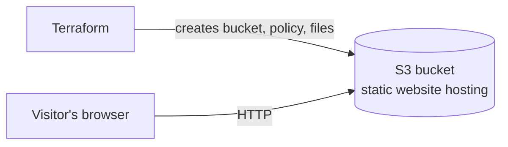
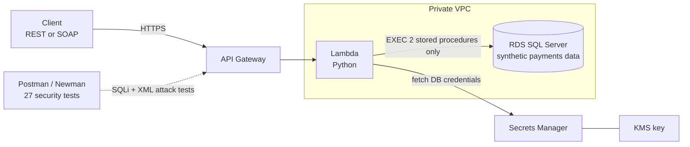
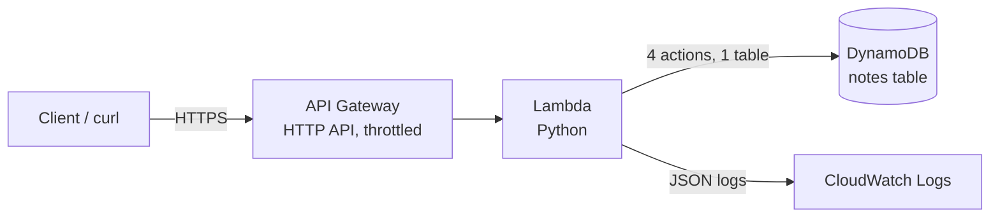
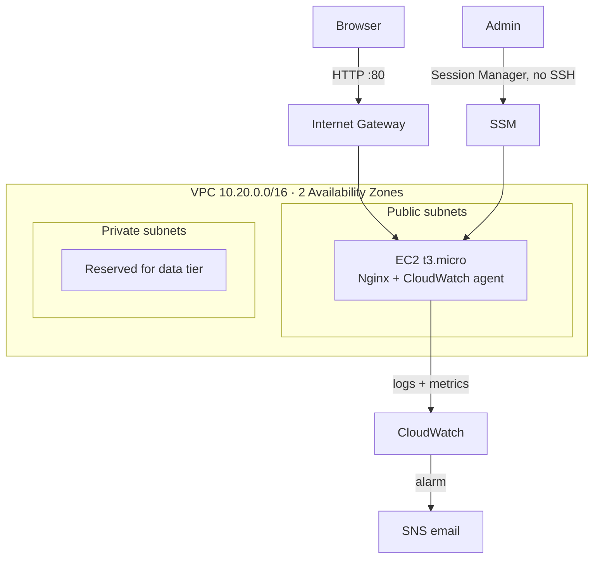
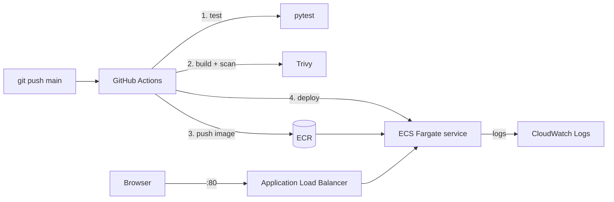
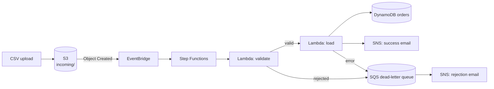
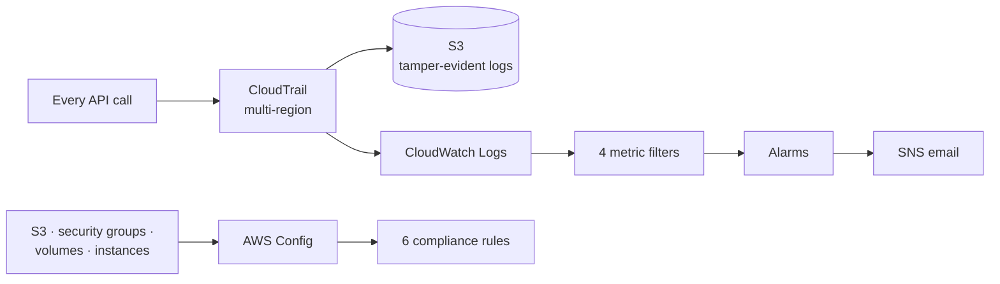

# ☁️ Discovering Cloud Engineering
 
**Aspiring Junior Cloud / DevOps Engineer** building hands-on AWS projects with Terraform, Python, containers and CI/CD, with a focus on security and cost control.
 
📍 Johannesburg, South Africa · 🎯 Open to Junior Cloud, DevOps and Platform Engineer roles
 
<!-- Add your links here before publishing -->
[LinkedIn](https://www.linkedin.com/in/your-profile) · [Email](mailto:your-email@example.com) · [CV](link-to-your-cv)
 
---
 
## ⚡ At a Glance (30-second summary)
 
- **7 AWS projects**, each deployed from code (Infrastructure as Code) and torn down after testing to keep costs near zero.
- **Security first:** least-privilege IAM, encryption, no SSH access, secrets in AWS Secrets Manager, and vulnerability scanning in CI/CD.
- **Tested and automated:** unit tests, security tests, and GitHub Actions pipelines.
- **Built within real limits:** projects run in a restricted AWS sandbox, so each design shows how I work around constraints on instance size, Lambda usage and service availability.
## 🧰 Core Skills
 
| Area | Tools |
|------|-------|
| **Cloud (AWS)** | EC2, VPC, S3, Lambda, API Gateway, DynamoDB, RDS, ECS Fargate, ECR, ALB, Step Functions, EventBridge, SQS, SNS |
| **Infrastructure as Code** | Terraform, CloudFormation |
| **Containers** | Docker (multi-stage, non-root images) |
| **CI/CD** | GitHub Actions, Trivy image scanning |
| **Security** | IAM least privilege, KMS, Secrets Manager, CloudTrail, AWS Config, SSM Session Manager |
| **Monitoring** | CloudWatch Logs, metrics and alarms, SNS alerting |
| **Languages & OS** | Python, T-SQL, Bash, Linux (Ubuntu) |
| **Testing** | pytest, moto, Postman/Newman |
 
## 📂 Projects
 
| # | Project | What it demonstrates | Key tech | Status |
|---|---------|----------------------|----------|--------|
| 01 | [Static Website on S3](https://github.com/masegoleroux-commits/Discovering-Cloud-Engineering/tree/main/cloud-pro_1/01-static-website-s3) | Infrastructure as Code basics: provision, deploy and destroy a website from code | S3, Terraform | ✅ Complete (torn down to avoid cost) |
| 02 | [Secure Payments Data API](https://github.com/masegoleroux-commits/Discovering-Cloud-Engineering/tree/main/cloud-pro_2/02-secure-payments-api) | Protecting sensitive data: card masking, stored-procedure-only access, 27 automated security tests | Lambda, API Gateway, RDS SQL Server, Secrets Manager, KMS, CloudFormation | 🟡 Code complete, deployment in progress |
| 03 | [Serverless Notes API](https://github.com/masegoleroux-commits/Discovering-Cloud-Engineering/tree/main/cloud-pro_3/03-serverless-notes-api) | Serverless REST API with least-privilege IAM and zero-cost unit tests | API Gateway, Lambda, DynamoDB, Terraform | 📅 Publishing Mon 12 Oct 2026 |
| 04 | [VPC + Hardened Web Server](https://github.com/masegoleroux-commits/Discovering-Cloud-Engineering/tree/main/cloud-pro_4/04-vpc-hardened-web-server) | Networking from scratch and server hardening with no SSH | VPC, EC2, SSM, CloudWatch, Terraform | 📅 Publishing Tue 13 Oct 2026 |
| 05 | [Containerised App on ECS Fargate](https://github.com/masegoleroux-commits/Discovering-Cloud-Engineering/tree/main/cloud-pro_5/05-ecs-fargate-cicd) | Automated releases from git push to production, with security scanning and auto-rollback | Docker, ECS Fargate, ECR, GitHub Actions, Trivy | 📅 Publishing Wed 14 Oct 2026 |
| 06 | [Event-Driven CSV Pipeline](https://github.com/masegoleroux-commits/Discovering-Cloud-Engineering/tree/main/cloud-pro_6/06-event-driven-csv-pipeline) | Reliable data processing: retries, error handling and no silently lost files | S3, EventBridge, Step Functions, SQS | 📅 Publishing Thu 15 Oct 2026 |
| 07 | [AWS Security Baseline](https://github.com/masegoleroux-commits/Discovering-Cloud-Engineering/tree/main/cloud-pro_7/07-aws-security-baseline) | Account-wide auditing, compliance checks and security alerting, used to audit projects 03–06 | CloudTrail, AWS Config, CloudWatch | 📅 Publishing Fri 16 Oct 2026 |
 
### 🗓️ Release schedule
 
Projects 03–07 are being published one a day from **Monday 12 to Friday 16 October 2026**. After that, expect a new project every week.
 
---
 
## 🏗️ Architecture Diagrams
 
Each diagram shows how the AWS services in a project connect. Click a project to expand it.
 

<b>01 – Static Website on S3</b>

 
Terraform creates everything; visitors read the site straight from the S3 website endpoint.
 

<b>02 – Secure Payments Data API</b>

 
The API login can only run two stored procedures, and card numbers are masked inside the database before they leave it.
 

<b>03 – Serverless Notes API</b>

 
One function handles all four routes; its IAM role can touch only the notes table and its own logs.
 

<b>04 – VPC + Hardened Web Server</b>

 
Only port 80 is open. Administration goes through SSM, so there is no SSH port or key pair.
 

<b>05 – Containerised App on ECS Fargate</b>

 
A release is blocked if Trivy finds a critical vulnerability, and ECS rolls back automatically if the new version fails health checks.
 

<b>06 – Event-Driven CSV Pipeline</b>

 
Temporary errors are retried; invalid files are never retried and always end up in the dead-letter queue with a reason.
 

<b>07 – AWS Security Baseline</b>

 
CloudTrail records who did what; AWS Config checks whether resources break the rules. Together they detect and explain issues.
 

> Diagrams are written in [Mermaid](https://mermaid.js.org/), which GitHub renders automatically, so they stay up to date with the code.
 
---
 
## 🔍 Project Details
 
### 01 – Static Website on S3
 
A website hosted on Amazon S3 and deployed entirely with Terraform: bucket creation, static hosting, a public-read policy for the site files, and the page upload.
 
**Shows:** the core Infrastructure as Code workflow (`init`, `plan`, `apply`, `destroy`) and cost awareness. The live site was taken down to avoid charges and can be redeployed in one command.
 
### 02 – Secure Payments Data API
 
A secured REST and SOAP API in front of a SQL Server payments database, using synthetic (made-up) data.
 
**Shows:**
* **Data protection:** card numbers masked in T-SQL; credentials stored in AWS Secrets Manager
* **Least privilege:** the API login can run only two specific stored procedures
* **Database skills:** tables, stored procedures, roles, and versioned migrations with rollback
* **Security testing:** 27 Postman/Newman assertions covering SQL injection and XML attacks
* **Networking:** deployed inside a private VPC
**Status:** code complete, linted and unit-tested. Deployment is in progress. I've solved several sandbox restrictions (password generation, inline IAM policies, policy deletion) and am troubleshooting a CloudFormation rollback.
 
### 03 – Serverless Notes API
 
A REST API to create, read, list and delete notes, built on API Gateway, Python Lambda and DynamoDB, all deployed with Terraform.
 
**Shows:**
* **Least-privilege IAM:** the function can perform 4 actions on one table and nothing else
* **Testing without cost:** unit tests run against mocked AWS (moto), never touching the cloud
* **Guardrails:** API throttling and validated limits for timeout and memory
### 04 – VPC + Hardened Web Server
 
A two-zone network built by hand, with one Nginx web server.
 
**Shows:**
* **Networking:** public and private subnets, route tables and an internet gateway, written without pre-built modules
* **No SSH:** administration only through AWS SSM Session Manager, so there is no open admin port
* **Hardening:** IMDSv2 required, encrypted disk, server version hidden
* **Monitoring:** logs and metrics in CloudWatch, with email alarms
### 05 – Containerised App on ECS Fargate
 
A Python web service packaged in a container and released automatically on every code push.
 
**Shows:**
* **CI/CD:** test → build → security scan → push → deploy, blocked if critical vulnerabilities are found
* **Safe releases:** zero-downtime rolling deploys with automatic rollback if the new version fails
* **Secure containers:** small multi-stage image running as a non-root user
### 06 – Event-Driven CSV Pipeline
 
Uploading a CSV file automatically starts a workflow that validates it and loads it into a database.
 
**Shows:**
* **Reliability:** automatic retries for temporary errors; rejected files go to a dead-letter queue with the reason
* **Alerting:** email on every success and every rejection
* **Safe re-runs:** uploading the same file twice doesn't create duplicate records
### 07 – AWS Security Baseline
 
Account-wide security controls, applied to my own earlier projects.
 
**Shows:**
* **Audit trail:** every API call recorded, with tamper-evident logs
* **Compliance checks:** 6 automated rules covering public buckets, open SSH, encryption and instance metadata security
* **Alerting:** alarms for root account use, denied API calls, firewall changes and logins without MFA
* **Real findings:** a log of issues it found in projects 03–06 and how I fixed them
---
 
## 💡 How I Work
 
- **Everything is code:** each project can be rebuilt from scratch and fully deleted with one command.
- **Cost-conscious:** resources are torn down after testing; nothing runs unnecessarily.
- **Documented decisions:** each project includes architecture diagrams, decision records explaining why I chose one option over another, and a runbook.
- **Honest results:** test data is synthetic and labelled; any deliberate failures or load tests are clearly marked.
## 🤝 Let's Connect
 
I'm actively looking for Junior Cloud, DevOps or Platform Engineer opportunities. I'd be glad to walk you through any of these projects.
 
[LinkedIn](https://www.linkedin.com/in/your-profile) · [Email](mailto:your-email@example.com)
